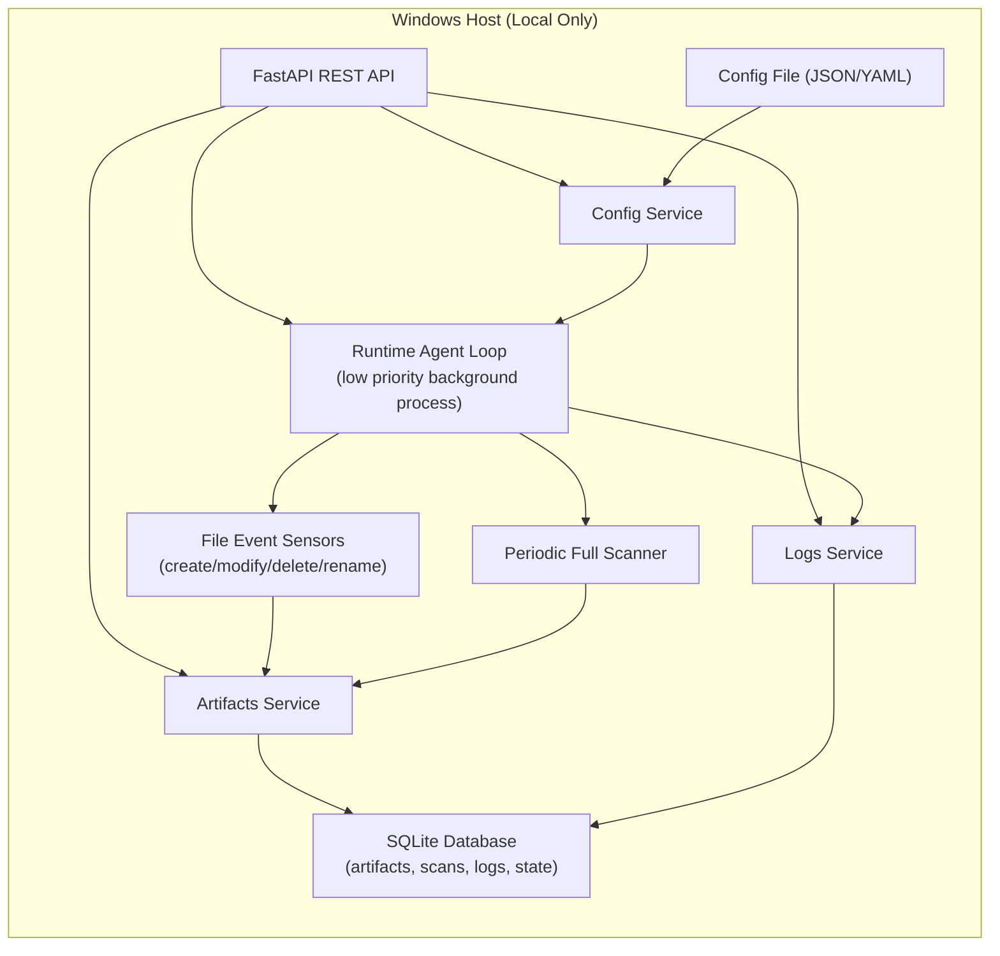

# code-steward-agent

## Dependencies

- **Python**
- **FastAPI**: API framework
  - defines the API
- **Uvicorn**: starts a server (`localhost:8000`), listens for requests, passes them to FastAPI, returns responses
  - runs the API

## How to install and run

### Create virtual env

```
python3 -m venv venv
source venv/bin/activate    # Mac/Linux
venv\Scripts\activate       # Windows
```

### Install dependencies

```
pip install requirements.txt
```

### Run the server

```
uvicorn CodeSteward:app --reload
```

- CodeSteward = filename
- app = FastAPI instance
- --reload = auto-restart on changes

### Send requests with curl

The default URL is `http://127.0.0.1:8000` or `http://localhost:8000`.

E.g.,

```
curl http://localhost:8000
```

```
curl http://127.0.0.1:8000/system/health
```

## Generated docs

http://localhost:8000/docs

## MVP API Skeleton

Current endpoint scaffolding:

- `GET /system/health`
- `GET /system/status`
- `GET /scan/status`
- `POST /scan/trigger`
- `GET /artifacts`
- `GET /artifacts/{artifact_id}`
- `GET /logs?limit=100`
- `GET /config`
- `POST /config/reload`

## MVP: A Local-First Architecture



Database note:

- SQLite is a good MVP default for local logs and metadata.
- Single-file DB keeps install simple and works offline.
- You can split into tables like: `artifacts`, `scan_runs`, `file_events`, `logs`, `agent_state`.
