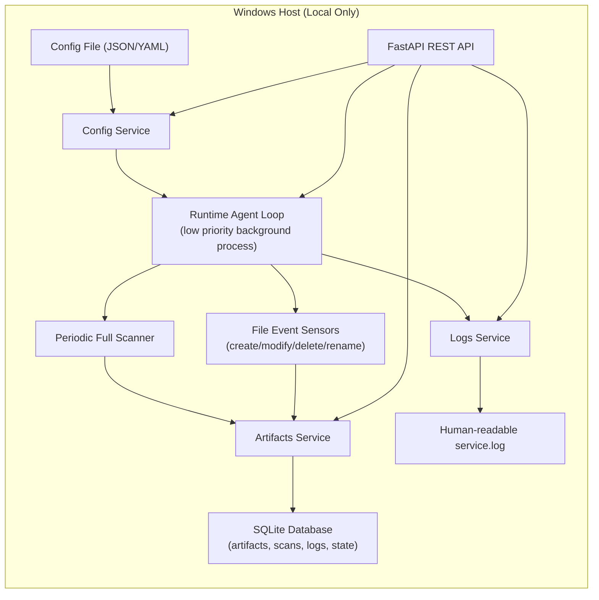

# code-steward-agent

## AI model testing

1. Install **[Python 3.10+](https://www.python.org/downloads/)** and **[Ollama](https://ollama.com/download)**. Open Ollama.
2. In this repository's folder, run:

   ```sh
   python ai_test.py
   ```

3. Choose a model from the menu. Missing models download automatically; results go to `ai-results/`.

**Defaults:** CPU only, six sample files, no extra Python packages or FastAPI setup.

| Want to… | Command |
|---|---|
| Compare all three models | `python ai_test.py compare --pull` |
| Compare on the 24-case test set | `python ai_test.py compare --suite dev --pull` |
| Switch model | `python ai_test.py run --model gemma-small --pull` |
| Try without Ollama (scripted demo) | `python ai_test.py demo` |

**[Short setup and teammate handoff guide](docs/AI_TESTING.md)**

**[Test dataset: 24 development cases, 12 final cases and 6 input checks](ai_lab/datasets/v1/README.md)**

## Dependencies

- **Python**
- **FastAPI**: API framework
  - defines the API
- **Uvicorn**: starts a server (`localhost:8000`), listens for requests, passes them to FastAPI, returns responses
  - runs the API

## How to install and run

### Create virtual env

```
python3 -m venv venv
source venv/bin/activate    # Mac/Linux
venv\Scripts\activate       # Windows
```

### Install dependencies

```
pip install -r requirements.txt
```

### Run the server

```
uvicorn CodeSteward:app --reload
```

- CodeSteward = filename
- app = FastAPI instance
- --reload = auto-restart on changes

### Send requests with curl

The default URL is `http://127.0.0.1:8000` or `http://localhost:8000`.

E.g.,

```
curl http://localhost:8000
```

```
curl http://127.0.0.1:8000/system/health
```

## Generated docs

http://localhost:8000/docs

## MVP API Skeleton

Current endpoint scaffolding:

- `GET /system/health`
- `GET /system/status`
- `GET /scan/status`
- `POST /scan/trigger`
- `GET /artifacts`
- `GET /artifacts/{artifact_id}`
- `GET /logs?limit=100`
- `GET /config`
- `POST /config/reload`

## Verify artifact classification

1. Start the API and call `POST /system/start` from `/docs`.
2. Create, edit, or move a supported file inside a configured `root_paths` directory.
3. Call `GET /artifacts` to see its current name, path, type, size, hash, and change type.

The artifact ID stays the same when a known file is edited or moved. Its hash changes
when its contents change.

## Saved artifact records

Artifact records are saved automatically in `artifacts.sqlite3` in the project
directory. Restarting the API keeps the records and their IDs. SQLite is included
with Python, so the existing installation commands still work.

The existing `ArtifactsService` handles saving and querying. `ScanService` uses
these saved records to check which files have changed. The API endpoints and
response fields stay the same.

When upgrading from the previous version, start the service and trigger one scan
to populate the database. The old `scan_checkpoint.json` does not contain complete
artifact records or IDs, so it is ignored when the artifact service is connected.
The scanner still supports that JSON file when used without an artifact service.

To check persistence:

1. Set `scanning.root_paths` in `config.yaml` to your test folder.
2. Start the API, call `POST /system/start`, then `POST /scan/trigger`.
3. Call `GET /artifacts` and note a file's ID.
4. Stop and restart the API. Call `GET /artifacts` again: the file and ID remain.
5. Start the service and scan again. Unchanged files stay in the list even when
   the scan reports `files_found: 0` (this count means new or changed files).

The database contains the latest file information. File contents stay in their
original locations. Keep the database to keep these records; Git ignores the
database and its temporary files. The scanner skips its own database files.

This change also lets a scan continue when a file disappears while its size or
modification time is being read. Other scanning work is still pending: preserving
events during pause or a busy scan, detecting deletions missed by the watcher,
handling consecutive renames, periodic scans, and avoiding repeated full hashing.

Run the regression tests from the project directory:

```sh
python -m unittest discover -s tests -v
```

## Runtime logs

`GET /logs` reads real application events from `service.log` in the project
directory. Entries survive server restarts and are returned newest first.
The existing plain-text history is also readable. New entries include a UTC
timestamp, severity, source module and message; old entries retain their original
local timestamps and have `source: null` when no source was recorded.
Multiline exception details stay with the event that produced them.

Query parameters:

- `limit`: maximum matching entries, from 1 to 1000; default 100.
- `level`: optional exact level: DEBUG, INFO, WARNING, ERROR or CRITICAL.
- `search`: optional case-insensitive message text, up to 200 characters.

Filters apply before the limit. `count` is the number returned, not the total
number of historical entries. No matches return an empty list with HTTP 200.
Invalid parameters return HTTP 422. An unreadable log file returns HTTP 503
with a short explanation; a missing log file is treated as an empty history.

```sh
curl "http://127.0.0.1:8000/logs?limit=20"
curl "http://127.0.0.1:8000/logs?limit=20&level=WARNING&search=blocked"
```

The logger captures scanning requests and results, file changes, service
controls, skipped paths, blocked scans and errors. File-type exclusions are
summarized per scan. Idle ticks are DEBUG messages and are not recorded at the
default INFO level, so routine heartbeats do not bury useful events. This
version uses the existing local log file; it does not add log rotation or an
AI reasoning module. Filters with no matches may need to scan the full history.

To verify in `/docs`, open `GET /logs`, choose **Try it out**, set `limit` to 20,
then choose **Execute**. Look under **Server response / Response body**.
Pause the service, request a scan, and query with `level=WARNING` and
`search=blocked`: the rejected scan and its reason should appear. Resume the
service after this check. Reading logs does not itself generate application
log records. Execute the query again to refresh; the page does not auto-update.

The automated suite includes temporary-file log tests and real HTTP tests of
the logs controller. Run `python -m unittest discover -s tests -v` after installing
the existing requirements; no additional test dependency is needed.

## MVP: A Local-First Architecture



Database note:

- SQLite is a good MVP default for local logs and metadata.
- Single-file DB keeps install simple and works offline.
- You can split into tables like: `artifacts`, `scan_runs`, `file_events`, `logs`, `agent_state`.
